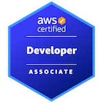
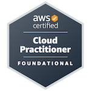
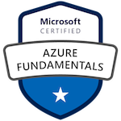
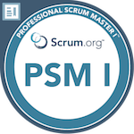

# My Certifications

All professional certifications I achieved.

- [Amazon Web Services (AWS)](https://github.com/MvdSman/my-certifications/tree/main/AWS)
- [Microsoft Azure](https://github.com/MvdSman/my-certifications/tree/main/Microsoft-Azure)
- [Scrum](https://github.com/MvdSman/my-certifications/tree/main/Scrum)

# Credly

To view the certifications linked to my Credly-account, please [click here](https://www.credly.com/users/mark-van-der-sman).

## Badges

